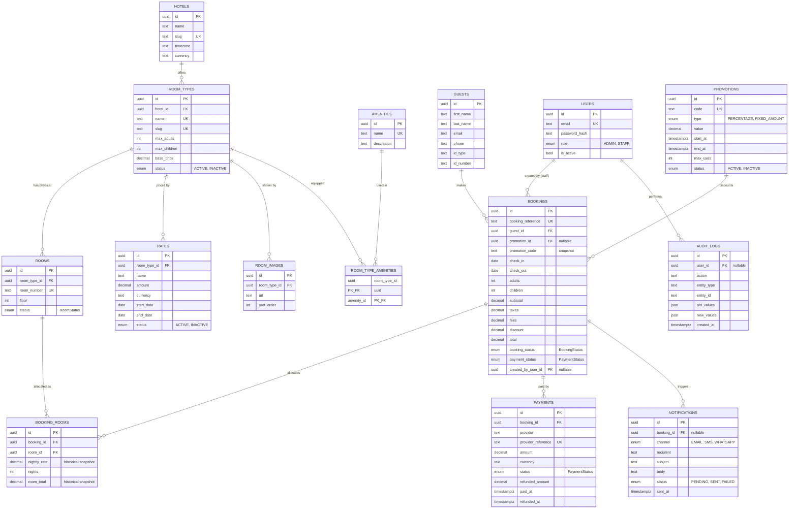

# Santo Hotel — Entity Relationship Diagram (P2)

## Cardinality summary

| Relationship | Type | Notes |
| ------------ | ---- | ----- |
| Hotel → Room Types | 1—* | single-tenant, but modeled |
| Room Type → Room | 1—* | one category, many physical rooms |
| Room Type → Rate | 1—* | date-bounded pricing |
| Room Type ↔ Amenity | *—* | via `room_type_amenities` |
| Room Type → Room Image | 1—* | category photography |
| Guest → Booking | 1—* | guest history |
| User → Booking | 1—* | staff-created/manual bookings (nullable) |
| Promotion → Booking | 1—* | nullable; applied values snapshotted |
| Booking → Booking Room | 1—* | one reservation, many rooms |
| Room → Booking Room | 1—* | same room across many bookings |
| Booking → Payment | 1—* | one booking, many transactions/refunds |
| Booking → Notification | 1—* | confirmations, reminders |
| User → Audit Log | 1—* | accountability trail |

## Key design decisions

- **Room type vs physical room** — shared attributes on `room_types`, inventory on `rooms`.
- **Historical snapshots** — `booking_rooms.nightly_rate`/`room_total`, booking totals and
  `promotion_code` preserve what was actually charged; current rates can change freely.
- **Availability-friendly indexes** — `rooms(status, room_type_id)`,
  `booking_rooms(room_id)`, `bookings(check_in, check_out, booking_status)` support the
  P4 overlap query. The DB-level exclusion constraint is added in P4 after the
  check-in/out turnover policy is confirmed (`docs/OPEN_QUESTIONS.md` #7, #8).
- **Deletion behavior** — guests/bookings/rooms are `RESTRICT` (audit-safe); booking
  rooms cascade with their booking; user references on bookings/audits become `NULL`.
- **No card data** — payments store provider references only.
